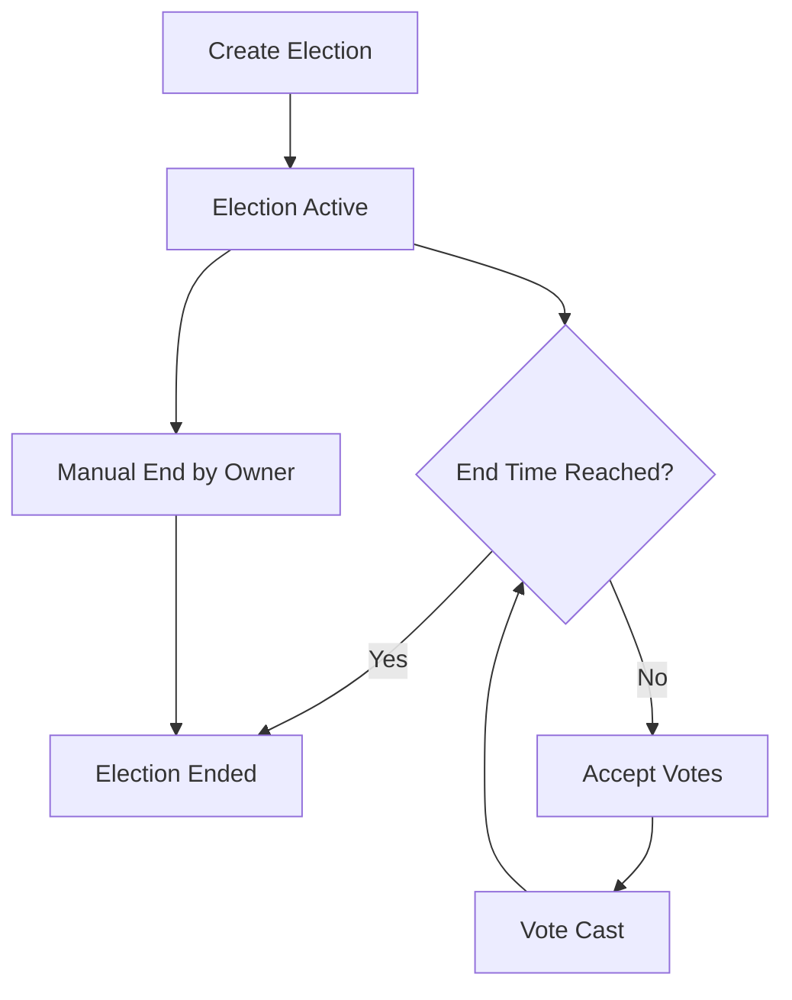
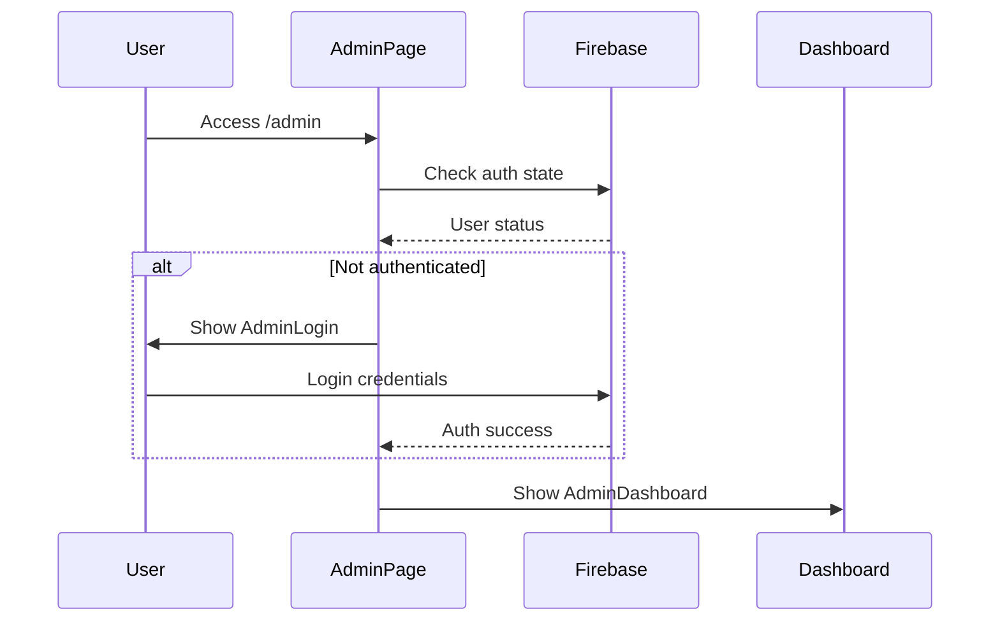

# openKura - Decentralized Voting System Documentation

## Table of Contents
1. [Project Overview](#project-overview)
2. [Smart Contract Architecture](#smart-contract-architecture)
3. [Frontend Architecture](#frontend-architecture)
4. [Admin Dashboard Architecture](#admin-dashboard-architecture)
5. [Blockchain Integration Layer](#blockchain-integration-layer)
6. [Firestore Data Model](#firestore-data-model)
7. [APIs and Hooks](#apis-and-hooks)
8. [Security Considerations](#security-considerations)
9. [Environment Variables & Configuration](#environment-variables--configuration)
10. [Deployment Notes](#deployment-notes)

---

## Project Overview

**openKura** is a modern decentralized voting system built on the Ethereum blockchain, combining Web3 technology with traditional web application architecture. The platform enables transparent, secure, and immutable elections through smart contracts while providing an intuitive user experience via a Next.js frontend.

### 🏗️ Technology Stack

| Component | Technology | Purpose |
|-----------|------------|---------|
| **Frontend** | Next.js 16 + React 19 | Modern web application framework |
| **UI Library** | shadcn/ui + Tailwind CSS | Component system and styling |
| **Icons** | Lucide React | Consistent iconography |
| **Blockchain** | Ethereum (Sepolia Testnet) | Smart contract deployment |
| **Smart Contracts** | Solidity 0.8.19 | Decentralized voting logic |
| **Web3 Integration** | Ethers.js 6.16.0 | Blockchain interaction |
| **Database** | Firebase Firestore | Election metadata and admin data |
| **Authentication** | Firebase Auth | Admin authentication |
| **Storage** | Firebase Storage | File uploads and media |
| **Development** | Hardhat | Smart contract development |
| **Deployment** | Vercel/Netlify | Frontend deployment |

### 🎯 Key Features

- **Decentralized Voting**: Elections stored and executed on Ethereum blockchain
- **Admin Dashboard**: Secure admin panel for election management
- **Wallet Integration**: MetaMask wallet connection for voting
- **Real-time Updates**: Live election statistics and voter participation
- **Responsive Design**: Mobile-first responsive interface
- **Demo Mode**: Fallback demo data when blockchain isn't configured

---

## Smart Contract Architecture

### 📋 Contract Overview

The `VotingSystem.sol` contract manages the core voting logic on the Ethereum blockchain.

**Contract Address**: `0x72C303cF197D71012bE546eFFea9886F70ACED61` (Sepolia)

### 🏛️ Core Data Structures

```solidity
struct Election {
    string title;           // Election title
    string description;     // Election description  
    uint256 endTime;        // End timestamp
    bool isActive;          // Active status
    uint256 totalVotes;     // Vote count
    mapping(address => bool) hasVoted;  // Voter tracking
    address[] voters;       // Voter addresses
}
```

### 🔧 Key Functions

#### Election Management

| Function | Access | Description |
|----------|--------|-------------|
| `createElection()` | Public | Creates new election with title, description, endTime |
| `getElection()` | View | Returns election details by ID |
| `getAllElections()` | View | Returns all elections with metadata |
| `getElectionCount()` | View | Returns total number of elections |
| `endElection()` | Owner Only | Manually ends an active election |

#### Voting Functions

| Function | Access | Description |
|----------|--------|-------------|
| `vote()` | Public | Casts vote for specific election |
| `hasVoted()` | View | Checks if address has voted |
| `getTotalVotes()` | View | Returns vote count for election |
| `getVoters()` | View | Returns array of voter addresses |

### 🔔 Events

```solidity
event ElectionCreated(uint256 indexed electionId, string title, address creator);
event Voted(uint256 indexed electionId, address indexed voter);
```

### 🛡️ Security Features

- **Owner-only Functions**: Critical functions restricted to contract owner
- **Vote Prevention**: Prevents double voting per address
- **Time Validation**: Elections automatically expire based on `endTime`
- **Input Validation**: Requires non-empty titles and future end times

### 📊 State Transitions



---

## Frontend Architecture

### 🗂️ Project Structure

```
app/
├── layout.tsx          # Root layout with metadata
├── page.tsx           # Home page with election list
├── loading.tsx        # Loading component
├── admin/
│   └── page.tsx       # Admin authentication page
│   └── edit/
│       └── [id]/
│           └── page.tsx   # Edit election page
└── vote/
    └── [id]/
        └── page.tsx   # Vote details page
```

### 🧩 Component Hierarchy

```
RootLayout
├── Header (navigation, wallet connect)
├── Pages
│   ├── HomePage (election listing)
│   ├── VoteDetailsPage (voting interface)
│   └── AdminPage (dashboard or login)
└── Toaster (notifications)
```

### 🎨 UI Library Usage

#### shadcn/ui Components
- **Form Components**: Button, Input, Label, Textarea, Select
- **Layout Components**: Card, Table, Tabs, Badge
- **Interactive**: Dialog, DropdownMenu, AlertDialog
- **Feedback**: Alert, Skeleton, Toast (Sonner)

#### Tailwind CSS Classes
- **Dark Mode**: `dark:` prefix for theme switching
- **Responsive**: `md:`, `lg:` breakpoints
- **Animations**: `animate-spin`, `transition-all`
- **Custom**: `bg-background`, `text-foreground`, etc.

### 🔄 Routing Strategy

- **Dynamic Routes**: `[id]` for election-specific pages
- **Protected Routes**: Admin pages require authentication
- **Client-side Navigation**: Next.js Link components
- **Route Groups**: Organized by functionality (admin, vote)

### 📱 Responsive Design

| Breakpoint | Width | Layout Changes |
|------------|-------|----------------|
| **Mobile** | < 768px | Single column, hamburger menu |
| **Tablet** | 768px - 1024px | Two column grid |
| **Desktop** | > 1024px | Multi-column layout |

---

## Admin Dashboard Architecture

### 🔐 Authentication Flow



### 🎛️ Dashboard Features

#### Election Management
- **Create Elections**: Form-based election creation
- **Edit Elections**: Modify existing election details
- **Delete Elections**: Remove elections (with confirmation)
- **Status Management**: Activate/deactivate elections

#### Statistics Display
- **Vote Counts**: Real-time voting statistics
- **Unique Voters**: Participant tracking
- **Election Status**: Active/ended election counts

### 🔄 Election Creation Workflow

1. **Admin Authentication**: Firebase Auth verification
2. **Wallet Connection**: MetaMask wallet connection
3. **Form Submission**: Title, description, end date input
4. **Blockchain Transaction**: Smart contract interaction
5. **Metadata Storage**: Firebase Firestore backup
6. **Confirmation**: Success notification and refresh

### 📊 Data Sources

| Priority | Source | Fallback |
|----------|--------|----------|
| 1 | Smart Contract | Blockchain data |
| 2 | Firebase Firestore | Metadata storage |
| 3 | Demo Data | Development/testing |

---

## Blockchain Integration Layer

### 🔌 Ethers.js Provider Setup

```typescript
// Provider hierarchy
1. BrowserProvider (MetaMask) - User interactions
2. JsonRpcProvider (Infura) - Read-only operations
3. Contract instances with ABI binding
```

### 🏪 Contract Connection Logic

```typescript
export function getContract(signerOrProvider?: ethers.Signer | ethers.Provider) {
  const provider = signerOrProvider || getProvider()
  return new ethers.Contract(CONTRACT_ADDRESS, VOTING_ABI, provider)
}
```

### 💰 Wallet Integration

#### Connection States
- **Disconnected**: No wallet connection
- **Connecting**: MetaMask popup active
- **Connected**: Wallet connected and authorized
- **Wrong Network**: Connected to non-Sepolia network

#### Network Handling
- **Auto-switch**: Prompts user to switch to Sepolia
- **Chain ID**: `11155111` (Sepolia testnet)
- **Error Handling**: User rejection, network errors

### 📝 Transaction Handling

```typescript
// Transaction flow
1. Prepare transaction parameters
2. Estimate gas costs
3. Send transaction to wallet
4. Wait for user confirmation
5. Monitor transaction status
6. Handle success/failure
```

### ⚠️ Error Management

| Error Type | Handling Strategy |
|------------|------------------|
| **User Rejection** | Show friendly message, retry option |
| **Network Error** | Auto-retry with exponential backoff |
| **Gas Estimation** | Provide gas fee estimates |
| **Contract Errors** | Parse and display human-readable errors |

---

## Firestore Data Model

### 🗄️ Collection Schema

#### Elections Collection (`elections`)

```typescript
interface Election {
  id: string              // Document ID
  electionId: number      // Blockchain election ID  
  title: string          // Election title
  description: string    // Election description
  status: 'active' | 'ended' | 'upcoming'
  createdAt: Timestamp   // Creation timestamp
  endDate: Date         // Election end date
  totalVotes?: number   // Cached vote count
  voters?: string[]     // Cached voter addresses
  bannerImage?: string  // Optional banner image URL
}
```

#### Admin Data (`admins`)

```typescript
interface AdminUser {
  uid: string           // Firebase Auth UID
  email: string        // Admin email
  role: 'admin'        // Role designation
  createdAt: Timestamp // Account creation
  lastLogin: Timestamp // Last login time
}
```

### 🔄 Data Synchronization

- **Blockchain → Firestore**: Cache contract data for performance
- **Firestore → Frontend**: Real-time updates via listeners
- **Fallback Strategy**: Demo data when services unavailable

### 📈 Query Patterns

```typescript
// Common Firestore queries
const electionsQuery = query(
  collection(db, "elections"),
  orderBy("createdAt", "desc"),
  limit(10)
)
```

---

## APIs and Hooks

### 🎣 Custom Hooks

#### `useWallet()`
**Purpose**: Manages wallet connection state and operations

```typescript
interface WalletState {
  address: string | null
  isConnected: boolean
  isConnecting: boolean
  chainId: number | null
  balance: string | null
  provider: ethers.BrowserProvider | null
  signer: ethers.Signer | null
}
```

**Key Methods**:
- `connect()`: Initialize wallet connection
- `checkConnection()`: Verify existing connection
- Network switching and error handling

#### `useVotingContract()`
**Purpose**: Abstracts smart contract interactions

**Key Methods**:
- `createElection()`: Create new election
- `vote()`: Cast vote
- `getTotalVotes()`: Get vote count
- `getVoters()`: Get voter list
- `hasVoted()`: Check voting status

### 🔧 Utility Functions

#### `lib/utils.ts`
- **`cn()`**: Conditional className utility (clsx + tailwind-merge)
- **Date formatting**: Election date display helpers
- **Address formatting**: Ethereum address truncation

#### `lib/contract.ts`
- **Contract configuration**: ABI and address management
- **Provider creation**: Ethers.js provider setup
- **Configuration validation**: Environment check

### 🌐 Type Definitions

#### `types/ethereum.d.ts`
```typescript
interface Window {
  ethereum?: {
    isMetaMask?: boolean
    request: (args: { method: string; params?: unknown[] }) => Promise<unknown>
    on: (event: string, callback: (...args: unknown[]) => void) => void
  }
}
```

---

## Security Considerations

### 🔐 Smart Contract Security

#### Access Control
- **Owner Restrictions**: Critical functions limited to contract owner
- **Vote Validation**: Prevents double voting per address
- **Time Constraints**: Elections auto-expire based on timestamps

#### Attack Prevention
- **Reentrancy**: No external calls in voting functions
- **Integer Overflow**: Solidity 0.8.19 built-in protection
- **Gas Optimization**: Efficient storage patterns

### 🛡️ Frontend Security

#### Authentication
- **Firebase Auth**: Secure admin authentication
- **Session Management**: Automatic session handling
- **Route Protection**: Admin routes require authentication

#### Data Validation
- **Input Sanitization**: Form validation with zod
- **Type Safety**: TypeScript throughout application
- **Environment Variables**: Sensitive data in environment

### 🔒 Wallet Security

#### Connection Security
- **MetaMask Integration**: Official wallet provider
- **Permission Requests**: Explicit user consent
- **Network Validation**: Ensures correct network connection

#### Transaction Security
- **Gas Estimation**: Prevents excessive gas costs
- **User Confirmation**: All transactions require approval
- **Error Handling**: Secure error message display

### 🚧 Preventing Double Votes

```solidity
// Smart contract level
require(!elections[electionId].hasVoted[msg.sender], "Already voted");
elections[electionId].hasVoted[msg.sender] = true;
```

```typescript
// Frontend level
const hasVoted = await contract.hasVoted(electionId, userAddress)
if (hasVoted) {
  toast.error("You have already voted in this election")
  return
}
```

---

## Environment Variables & Configuration

### 🔧 Environment Variables

#### Blockchain Configuration
```bash
# Network Configuration
NEXT_PUBLIC_RPC_URL=https://sepolia.infura.io/v3/YOUR_INFURA_KEY
NEXT_PUBLIC_CONTRACT_ADDRESS=0x72C303cF197D71012bE546eFFea9886F70ACED61

# Deployment Configuration  
PRIVATE_KEY=your_wallet_private_key_here
ETHERSCAN_API_KEY=your_etherscan_api_key_here
SEPOLIA_INFURA_URL=https://sepolia.infura.io/v3/YOUR_INFURA_KEY
```

#### Firebase Configuration
```bash
# Firebase Config
NEXT_PUBLIC_FIREBASE_API_KEY=your_api_key
NEXT_PUBLIC_FIREBASE_AUTH_DOMAIN=your_project.firebaseapp.com
NEXT_PUBLIC_FIREBASE_PROJECT_ID=your_project_id
NEXT_PUBLIC_FIREBASE_STORAGE_BUCKET=your_project.firebasestorage.app
NEXT_PUBLIC_FIREBASE_MESSAGING_SENDER_ID=your_sender_id
NEXT_PUBLIC_FIREBASE_APP_ID=your_app_id
```

### ⚙️ Configuration Files

#### Next.js (`next.config.ts`)
```typescript
const nextConfig = {
  experimental: {
    serverComponentsExternalPackages: ['firebase']
  }
}
```

#### Hardhat (`hardhat.config.js`)
```javascript
module.exports = {
  solidity: {
    version: "0.8.19",
    settings: {
      optimizer: { enabled: true, runs: 200 }
    }
  },
  networks: {
    sepolia: {
      url: process.env.SEPOLIA_INFURA_URL,
      accounts: [process.env.PRIVATE_KEY],
      gasPrice: 30000000000 // 30 gwei
    }
  }
}
```

#### Tailwind (`tailwind.config.js`)
```javascript
module.exports = {
  darkMode: 'class',
  content: ['./app/**/*.{js,ts,jsx,tsx}', './components/**/*.{js,ts,jsx,tsx}']
}
```

### 🌍 Network Configuration

| Network | Chain ID | RPC URL | Purpose |
|---------|----------|---------|---------|
| **Sepolia** | 11155111 | Infura/Alchemy | Production testnet |
| **Hardhat** | 1337 | localhost:8545 | Development |
| **Mainnet** | 1 | Infura/Alchemy | Production (future) |

---

## Deployment Notes

### 🚀 Next.js Deployment

#### Recommended Platforms
1. **Vercel** (Recommended)
   - Zero-config deployment
   - Automatic builds from Git
   - Environment variable management
   - Edge functions support

2. **Netlify**
   - Static site generation
   - Form handling
   - Identity management

#### Build Configuration
```bash
# Production build
npm run build

# Start production server
npm start

# Deployment commands
npm run deploy:vercel  # Custom script
```

#### Environment Variables Setup
- Configure all environment variables in deployment platform
- Use different variables for staging/production
- Ensure Firebase project matches environment

### 📦 Smart Contract Deployment

#### Deployment Process
```bash
# Compile contracts
npx hardhat compile

# Deploy to Sepolia
npx hardhat run scripts/deploy.js --network sepolia

# Verify on Etherscan
npx hardhat verify --network sepolia DEPLOYED_ADDRESS
```

#### Deployment Script (`scripts/deploy.js`)
```javascript
async function main() {
  const VotingSystem = await ethers.getContractFactory("VotingSystem");
  const contract = await VotingSystem.deploy();
  await contract.deployed();
  console.log("Contract deployed to:", contract.address);
}
```

### 🔥 Firebase Configuration

#### Project Setup
1. Create Firebase project
2. Enable Authentication (Email/Password)
3. Set up Firestore Database
4. Configure Storage bucket
5. Add web app configuration

#### Security Rules
```javascript
// Firestore rules
rules_version = '2';
service cloud.firestore {
  match /databases/{database}/documents {
    match /elections/{document} {
      allow read: if true;
      allow write: if request.auth != null;
    }
  }
}
```

### 🛠️ Production Setup Checklist

#### Pre-deployment
- [ ] Smart contract deployed and verified
- [ ] Firebase project configured
- [ ] Environment variables set
- [ ] Domain configured (if using custom domain)
- [ ] SSL certificate configured

#### Security
- [ ] Firebase security rules configured
- [ ] API keys restricted by domain
- [ ] Admin authentication tested
- [ ] Contract ownership verified

#### Performance
- [ ] Static assets optimized
- [ ] Images compressed and resized
- [ ] Caching headers configured
- [ ] CDN configured (if needed)

#### Monitoring
- [ ] Error tracking (Sentry/LogRocket)
- [ ] Analytics configured
- [ ] Uptime monitoring
- [ ] Performance monitoring

---

## 📚 Additional Resources

### Development Commands
```bash
# Development
npm run dev              # Start development server
npm run build           # Build for production
npm run lint            # Run ESLint

# Smart Contracts
npm run compile         # Compile contracts
npm run test:contract   # Run contract tests
npm run node           # Start local blockchain
```

### Useful Links
- [Next.js Documentation](https://nextjs.org/docs)
- [Ethers.js Documentation](https://docs.ethers.org)
- [Firebase Documentation](https://firebase.google.com/docs)
- [shadcn/ui Components](https://ui.shadcn.com)
- [Hardhat Documentation](https://hardhat.org/docs)

### Support & Maintenance
- Monitor contract events for suspicious activity
- Regular Firebase security rule audits
- Keep dependencies updated
- Monitor gas costs and optimize if needed
- Backup critical data and configurations

---

*This documentation is maintained as part of the openKura project. For questions or contributions, please refer to the project repository.*